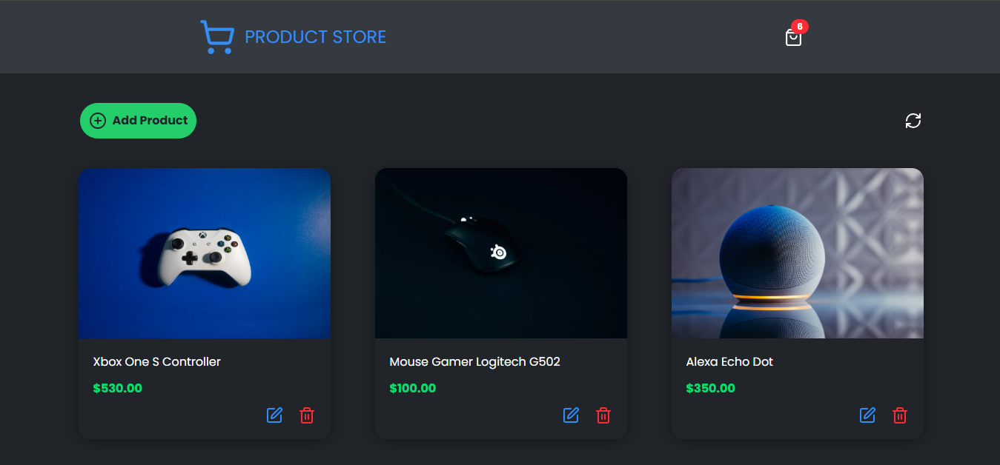

# Product Store

> This is a web application that simulates an electronics store, developed with the PERN Stack (PostgreSQL, Express, React, and Node.js). It allows users to add, edit, and delete products easily, as well as view the list of available items.

🔗 [Project Deploy](https://product-store-pern-78lb.onrender.com/ "Go to Site")
